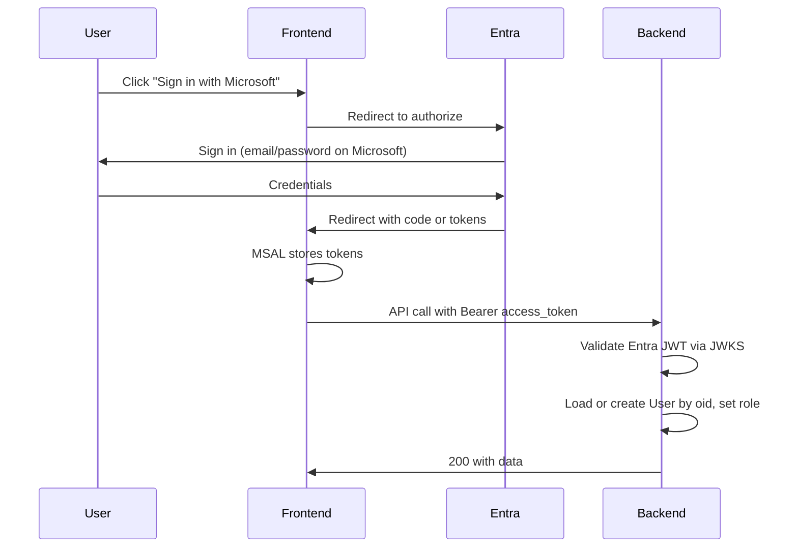

# Entra-only authentication migration plan

Use this plan when your Microsoft developer account and Entra tenant are ready. The app will use only "Sign in with Microsoft"; no email/password forms, no reCAPTCHA, no email verification, and no own JWT/refresh tokens.

---

## Prerequisites (before implementation)

- Microsoft 365 Developer Program tenant (or Azure AD tenant) with an App registration.
- In Entra: App registration with:
  - **Redirect URI(s):** SPA type, e.g. `http://localhost:5173` (dev) and your production origin (e.g. `https://your-app.vercel.app`).
  - **ID tokens** (and optionally **Access tokens**) enabled under Implicit grant / Authentication.
  - **API permissions:** OpenID `openid`, `profile`; optionally `email` or Microsoft Graph for email/name.
  - **App roles** (optional): Define roles (e.g. `staff`, `admin`) and assign to users/groups; then role appears in token. Otherwise role comes from your DB.
- **Application (client) ID** and **Directory (tenant) ID** from the App registration.
- For **SPA:** No client secret; use public client / MSAL with redirect or popup.

---

## High-level flow

---

## 1. Backend: Remove current auth and add Entra validation

### Remove

- `backend/src/controllers/authController.ts`: Delete `login`, `refresh` (and any signup if added). Keep `logout` only if you want an endpoint to clear server-side session; otherwise remove.
- `backend/src/routes/authRoutes.ts`: Remove `POST /login`, `POST /refresh`. Keep `POST /logout` only if you have server session to clear; otherwise remove or leave as no-op that returns 200.
- `backend/src/utils/jwt.ts`: Remove `signAccessToken`, `signRefreshToken`, `verifyRefresh` (and any MFA helpers). You will no longer issue or verify your own JWTs for auth.
- `backend/src/utils/cookies.ts`: Remove or stop using for auth cookies if you switch to Bearer-only.
- `backend/src/models/RefreshToken.ts`: Remove model and any references; Microsoft holds refresh tokens.
- `backend/src/models/User.ts`: Remove `password` and `comparePassword`; remove bcrypt. Add `externalId` (string, unique) for Entra `oid`; keep `email`, `role`. Optionally add `name`, `tenantId` (Entra `tid`).

### Add

- **Entra JWT validation:** New module (e.g. `backend/src/utils/entraAuth.ts` or middleware) that:
  - Reads `Authorization: Bearer <access_token>` (or cookie if you keep a session cookie).
  - Fetches Microsoft's JWKS from `https://login.microsoftonline.com/{tenantId}/discovery/v2.0/keys?appid={clientId}` (or standard OIDC discovery).
  - Verifies the JWT: signature with the right key, `iss` (e.g. `https://login.microsoftonline.com/{tenantId}/v2.0`), `aud` (your client ID or API audience if you set one), `exp`, `nbf`.
  - Extracts `oid` (and optionally `email`, `name`, `tid`, `roles` if in token).
- **Auth middleware:** Replace `backend/src/middleware/auth.ts` so it uses the Entra validator above. After validation, resolve or create your User by `externalId` (oid), set `role` from token claims (if using Entra app roles) or from your User document (default e.g. `staff`). Attach `user: { id, email, role }` to `req` (using your DB `_id` as `id`).
- **GET /api/auth/me:** Keep; it returns `req.user` (from middleware). So after Entra validation, `req.user` is your app user (id, email, role).
- **Optional session endpoint:** If you want a session cookie instead of sending the Bearer token on every request: e.g. `POST /api/auth/session` that accepts Entra access token in body, validates it, creates/updates User, sets a short-lived session cookie (e.g. signed session ID), returns user. Then auth middleware would accept either Bearer token or session cookie. For simplicity, Bearer-only is enough.

### Env

- `ENTRA_TENANT_ID`, `ENTRA_CLIENT_ID` (from App registration). Optional: `ENTRA_AUDIENCE` if you configure a custom API audience.

---

## 2. Shared package: Auth API

- `packages/shared/src/auth.ts`: Remove `login`, `refreshTokens`. Keep or add:
  - `getMe()`: GET /api/auth/me with credentials (cookie or Bearer). Used when the frontend has a token and wants to sync user to your backend.
  - `logoutApi()`: Optional; keep only if backend has a logout endpoint that clears something.
- **No login/refresh from shared:** The frontend will use MSAL to get tokens; then either call your API with the access token in the header, or call a session endpoint that sets a cookie. The shared package only needs a way to call your API with the current token (e.g. axios interceptor that adds `Authorization: Bearer <access_token>` from MSAL).

---

## 3. Frontend: MSAL and "Sign in with Microsoft"

### Remove

- Email/password form on `frontend/src/pages/LoginPage.tsx`. Replace with a single "Sign in with Microsoft" button.
- AuthContext usage of `login(email, password)` and any `authApi.login` / `authApi.refreshTokens`. No more loading auth from shared for login/refresh.

### Add

- **MSAL:** Install `@azure/msal-browser` (or `@azure/msal-react` for React). Configure with `clientId`, `authority` (e.g. `https://login.microsoftonline.com/{tenantId}`), `redirectUri`, and optionally `postLogoutRedirectUri`.
- **Login page:** One button that triggers MSAL `loginRedirect()` or `loginPopup()`. After successful login, MSAL stores the tokens; redirect to `/` (or your app root).
- **AuthContext (or equivalent):**
  - On load: use MSAL to get the current account and optionally get an access token (e.g. for your backend). If you use Bearer token: store the account and token (or get token when needed); set user from your backend `getMe()` using that token.
  - `login()`: Becomes "sign in with Microsoft" (call MSAL login; no email/password).
  - `logout()`: Call MSAL `logout()` (and optionally your backend logout if you have one), then redirect to login or to Microsoft's logout.
  - No more "refresh" from your backend; MSAL handles token refresh using Microsoft's refresh token.
- **API client:** Ensure every request to your backend sends the Entra access token: `Authorization: Bearer <access_token>`. Get the token from MSAL (e.g. `acquireTokenSilent` with the scope you registered; for "sign in only" you might use the same client ID as scope, or a custom scope if you defined an API in Entra).

### Env

- `VITE_ENTRA_CLIENT_ID`, `VITE_ENTRA_TENANT_ID` (and optionally `VITE_ENTRA_REDIRECT_URI` if different from default).

---

## 4. Role

- **Option A (Entra app roles):** In App registration, define app roles (e.g. `staff`, `admin`) and assign users/groups. Configure token to include `roles`. In your auth middleware, read `roles` from the token and map to your User.role (or use the first role).
- **Option B (your DB only):** No roles in token. After validating the token, look up User by `oid`; if not found, create User with `oid`, `email` (from token), `role: 'staff'`. Admin can change role in your DB. Attach this user to `req.user`.

---

## 5. Cookie consent and logout

- **Cookies:** If you switch to Bearer-only, you might not set any auth cookies; list "no auth cookies" or "session cookie (if used)" in your cookie policy. If you add a session endpoint that sets a cookie, list that cookie and keep the footer cookie banner.
- **Logout:** Frontend calls MSAL `logout()`. Optionally call your backend `POST /api/auth/logout` if you set a session cookie; backend clears the cookie.

---

## 6. What you do not need

- reCAPTCHA (backend or frontend).
- Rate limiting on login/signup (Microsoft handles it).
- Email verification flow, VerificationToken, or email sender for auth.
- Your own JWT signing or RefreshToken model.
- Signup form (email/password); "sign up" = "Sign in with Microsoft" for new users.
- Passkey "Add passkey" in your app (Entra supports FIDO2/passkeys).

---

## 7. Suggested order

1. Entra: Create App registration, redirect URIs, permissions, optional app roles.
2. Backend: Add Entra JWT validation and new auth middleware; remove login/refresh controllers and routes, JWT signing, RefreshToken model; update User model (no password, add externalId).
3. Shared: Remove login/refreshTokens; keep getMe (and optionally logoutApi); ensure API client can send Bearer token (caller will set it from MSAL).
4. Frontend: Install and configure MSAL; replace LoginPage with "Sign in with Microsoft"; rework AuthContext to use MSAL account and token, and get user from backend getMe() with that token.
5. Test end-to-end: Sign in with Microsoft, call protected route, confirm backend sees correct user and role.
6. Update cookie policy and docs (no auth cookies or only session cookie if used).

---

## 8. Files to touch (summary)

| Area | Remove / change | Add |
|------|------------------|-----|
| Backend | authController (login, refresh), authRoutes (POST login/refresh), jwt.ts (sign/verifyRefresh), cookies (if Bearer-only), RefreshToken model, User.password + bcrypt | Entra JWT validation util, new auth middleware, User.externalId |
| Shared | login(), refreshTokens() | Bearer token attachment for API (or keep getMe only) |
| Frontend | Email/password form, AuthContext login/refresh usage | MSAL config, "Sign in with Microsoft", AuthContext from MSAL + getMe |

When your Microsoft dev account and tenant are ready, use this plan to implement step by step.
