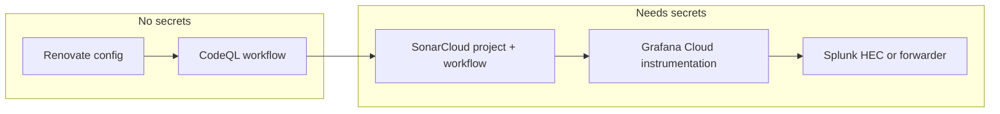

# Observability, Code Quality, and Dependency Automation Plan

## Current state

- **CI:** [.github/workflows/ci.yml](.github/workflows/ci.yml) runs backend tests, frontend unit tests, E2E (Playwright), then deploy. No CodeQL, Sonar, or Renovate.
- **Repo:** Yarn workspaces: `backend`, `frontend`, `packages/shared`. Node 20.

## 1. Renovate — monthly dependency update PRs

**Goal:** One or more PRs per month with dependency updates; CI must pass before merge.

**Implementation:**

- Add **Renovate** via GitHub: **Settings → Integrations → GitHub Apps → Renovate** (install on this repo). No repo config required for basic behavior.
- Add repo-level config so updates are **monthly** and **grouped** (optional but cleaner):
  - Create `renovate.json` (or `.github/renovate.json`) at repo root with:
    - `schedule`: e.g. `["on the 1st of every month"]` (cron).
    - `timezone`: e.g. `"UTC"`.
    - Optional: `packageRules` to group patch/minor per workspace (e.g. `backend`, `frontend`, `shared`) or group all non-major into one PR.
  - Renovate will open PRs that touch `package.json` / `yarn.lock`; existing CI (backend-test, frontend-test, e2e) will run on those PRs. Require CI pass in branch protection.

**Secrets:** None. Renovate App uses its own GitHub identity.

---

## 2. CodeQL — security SAST in GitHub Actions

**Goal:** Run CodeQL on every push/PR; surface findings in Security tab and optionally block on critical/high.

**Implementation:**

- Add a new workflow: `.github/workflows/codeql.yml`.
  - Use official `github/codeql-action/init` and `analyze` (e.g. `actions/codeql-action/init@v3`, `analyze@v3` or latest).
  - Enable languages relevant to this repo: **JavaScript** (or **javascript-typescript** if you want TypeScript included; CodeQL treats TS as JS). No need for separate Python/Go.
  - Run on `push` to default branch and `pull_request` to default branch; concurrency cancel in-flight.
  - Optional: add a `config-file` (e.g. `.github/codeql/codeql-config.yml`) to customize queries (e.g. exclude certain rules or include security-extended).
- In **Settings → Code security and analysis**, enable **CodeQL** (and **Dependabot alerts** if desired; Renovate will handle version updates, but Dependabot alerts are free and complement).
- In **Branch protection** for `main`/`master`: add **CodeQL** as a required status check so PRs must pass before merge.

**Secrets:** None for public repos. For private repos, GitHub Advanced Security may be required.

---

## 3. SonarCloud — code quality and security in PRs

**Goal:** Run SonarCloud analysis on every PR; Quality Gate and PR decoration; same repo and PR flow as CodeQL.

**Implementation:**

- **SonarCloud setup (manual once):**
  - Sign in at [sonarcloud.io](https://sonarcloud.io) with GitHub.
  - Add the **clinic-front-desk** repo (or org). Create a new project; SonarCloud will suggest **analysis method: GitHub Actions**.
  - Get the **Project Key** and **Organization** from SonarCloud (e.g. `org_key-clinic-front-desk`).
  - In GitHub: **Settings → Secrets and variables → Actions** → add `SONAR_TOKEN` (create token in SonarCloud under My Account → Security).
- **Workflow:** Add `.github/workflows/sonarcloud.yml`:
  - Trigger: `push` and `pull_request` to default branch (align with CodeQL).
  - Steps: checkout, setup Node 20, install deps (`yarn install --frozen-lockfile`), build shared + frontend (and backend if you want backend included in one project), run SonarCloud scanner.
  - For **monorepo**, two common approaches:
    - **Single SonarCloud project:** Run scanner once at repo root with `sonar.projectBaseDir` and include all modules (backend, frontend, shared) so one Quality Gate and one PR decoration. Use `sonar.sources`, `sonar.exclusions` to include only relevant dirs (e.g. `backend/src`, `frontend/src`, `packages/shared/src`).
    - **Multiple projects:** One SonarCloud project per workspace and separate workflow/job per project (more setup, clearer per-app metrics).
  - Use **SonarCloud Action** (`SonarSource/sonarcloud-github-action`) and pass `SONAR_TOKEN`, organization key, project key. Optionally pass `args` for extra params (e.g. `-Dsonar.exclusions=...`).
  - Example env for single project: `SONAR_ORGANIZATION`, `SONAR_PROJECT_KEY` (or pass in workflow from vars).
- **Branch protection:** Add the **SonarCloud** status check (e.g. "SonarCloud Code Analysis") as required so PRs must pass Quality Gate.

**Secrets:** `SONAR_TOKEN` in GitHub Actions secrets.

---

## 4. Grafana Cloud — metrics and logs

**Goal:** Send backend (and optionally frontend) metrics and logs to Grafana Cloud free tier; one dashboard and optional alert.

**Implementation:**

- **Grafana Cloud account:** Sign up at [grafana.com/products/cloud](https://grafana.com/products/cloud/) (free tier). Note:
  - **Metrics:** Hosted Prometheus or Grafana Cloud Metrics endpoint (Prometheus remote-write URL + user/password).
  - **Logs:** Grafana Cloud Loki endpoint (URL + user/password or API key).
  - **Traces:** Optional (Grafana Tempo); can add later.
- **Backend (Node/Express):**
  - Add a **Prometheus client** (e.g. `prom-client`) to expose `/metrics` (request count, latency, errors). Optionally use `express-prometheus-middleware` or similar.
  - **Logging:** Keep structured logs (e.g. JSON) and ship them to Loki. Options:
    - **Grafana Agent** (run alongside app): scrape `/metrics` and tail log files, then remote-write to Grafana Cloud. No code change; config in agent.
    - **Push from app:** Use a small runtime logger that forwards logs to Loki (e.g. `pino` + `pino-loki` or HTTP push to Loki). Requires `GRAFANA_LOKI_URL` and credentials in env.
  - Env vars (e.g. in backend `.env` and Render): `GRAFANA_PROM_REMOTE_URL`, `GRAFANA_METRICS_USER`, `GRAFANA_METRICS_PASSWORD` (or API key); optionally `GRAFANA_LOKI_URL`, `GRAFANA_LOKI_API_KEY` if pushing logs from app.
- **Frontend (optional):**
  - For errors: use **Grafana Faro** (RUM) or a simple `window.onerror` / React error boundary that POSTs to a backend endpoint which forwards to Loki or to Grafana Cloud. Alternatively use Faro's endpoint to send errors to Grafana Cloud.
  - For RUM metrics (page load, etc.): Faro or skip for now and add later.
- **Dashboard:** In Grafana Cloud, create a dashboard with panels for: backend request rate, latency (e.g. histogram or p95), error rate, and (if configured) log volume. Optionally one alert: e.g. error rate > threshold or backend down.

**Secrets / env:** Store Grafana Cloud credentials in GitHub Actions (for any CI step that might send test metrics) and in Render (backend) and optionally Vercel (frontend) for production.

---

## 5. Splunk — audit / compliance log retention (free tier)

**Goal:** Satisfy "slight need" for audit (who logged in, when) and retention; use free tier only.

**Implementation:**

- **Splunk Free or Splunk Cloud free trial:** Install **Splunk Free** (local) or use **Splunk Cloud** free trial. Get a **HEC (HTTP Event Collector)** token and URL for ingestion.
- **What to send:** Backend **audit-style events** (e.g. login success/failure, user id, timestamp, IP). Emit these as structured logs (e.g. JSON) from Express (e.g. in auth middleware or login route). Do **not** log passwords or tokens.
- **How to get logs into Splunk:**
  - **Option A (simplest):** Backend writes audit events to a **file** (e.g. `logs/audit.jsonl`); run **Splunk Universal Forwarder** (or a small forwarder) on the same host to send that file to Splunk. No backend dependency on Splunk SDK.
  - **Option B:** Backend sends events **directly** to Splunk HEC (HTTP POST) using env: `SPLUNK_HEC_URL`, `SPLUNK_HEC_TOKEN`. Add a small logging helper that POSTs JSON to HEC; keep it fire-and-forget (non-blocking) so it doesn't slow requests.
- **Retention:** Splunk Free has limited retention (e.g. 1 day or 500 MB/day); document that for real compliance you'd need paid or longer retention. Use Splunk mainly for "we have an audit trail" and incident lookups.

**Secrets:** `SPLUNK_HEC_URL`, `SPLUNK_HEC_TOKEN` in backend `.env` and Render (if using Option B). No need in GitHub Actions unless you run Splunk in CI (not typical).

---

## 6. Order of implementation and dependencies

Suggested order:

1. **Renovate** — install app, add `renovate.json`; verify one PR (or dry-run).
2. **CodeQL** — add `.github/workflows/codeql.yml`, enable in repo settings, add required check.
3. **SonarCloud** — create project, add `SONAR_TOKEN`, add `.github/workflows/sonarcloud.yml`, add required check.
4. **Grafana Cloud** — add Prometheus metrics and (optionally) Loki logging in backend; env vars in Render; create one dashboard (+ optional alert).
5. **Splunk** — add audit log emission in backend; configure HEC or file + forwarder; add env vars for production.

---

## 7. Branch protection (recommended)

On `main`/`master`:

- Require status checks: **Backend tests**, **Frontend unit tests**, **E2E**, **CodeQL**, **SonarCloud** (and **Deploy** if you want it blocking).
- Require PR reviews if your policy needs it.
- Do not require Renovate's own status (Renovate PRs should be required to pass CI, which includes the above).

---

## 8. Docs to add

- **README:** Short "Development" or "Operations" subsection: link to Grafana Cloud dashboard (or "metrics in Grafana Cloud"), mention audit logs in Splunk (free tier), and that CodeQL + SonarCloud run on every PR; dependency updates are handled by Renovate (monthly).
- Optional: `docs/OBSERVABILITY.md` with env vars (without values), where to find dashboards, and how to add alerts.

---

## Summary

| Item          | Where                                                   | Secrets / config                                   |
| ------------- | ------------------------------------------------------- | -------------------------------------------------- |
| Renovate      | Repo root `renovate.json` + GitHub App                    | None                                               |
| CodeQL        | `.github/workflows/codeql.yml`                           | None (public); Advanced Security for private       |
| SonarCloud    | `.github/workflows/sonarcloud.yml` + SonarCloud project  | `SONAR_TOKEN`                                      |
| Grafana Cloud | Backend: prom-client + optional Loki; dashboard in Grafana | Grafana Cloud metrics + Loki credentials in Render |
| Splunk        | Backend: audit logs → file or HEC                        | `SPLUNK_HEC_URL` + `SPLUNK_HEC_TOKEN` (if HEC)     |

All of the above integrate with the same repo and PR flow; Renovate's monthly PRs will run the full CI (including CodeQL and SonarCloud) before merge.
